# Mandelbrot Set Example

**▶ Follow along on the live app: [dcorp80.github.io/z80cpu-lab](https://dcorp80.github.io/z80cpu-lab/)**

## Description

A Z80 program that computes the Mandelbrot set and renders it as ASCII into memory starting at `4000h`. A guided tour of the explorer: load a binary, single-step through fetch/execute, watch memory fill in as the program runs, drive it with breakpoints, then trigger a non-maskable interrupt against a halted CPU.

- Source: [mandelbrot.asm](mandelbrot.asm)
- Binary: [mandelbrot.bin](mandelbrot.bin) — download this; you'll load it in step 1.

## Step-by-step

0. **Start cold**
   - Reload the page or press the "Cold Start" button to clear any prior session.

1. **Load the program**
   - Go to the "Program" panel.
   - Click "Add" → select `mandelbrot.bin`.
   - The program is written to the emulator's memory and persisted in browser storage.
   - The disassembled preview appears in the "Instruction trace" section's PREVIEW (NEXT AT PC) panel.
   - 

        
screenshot

     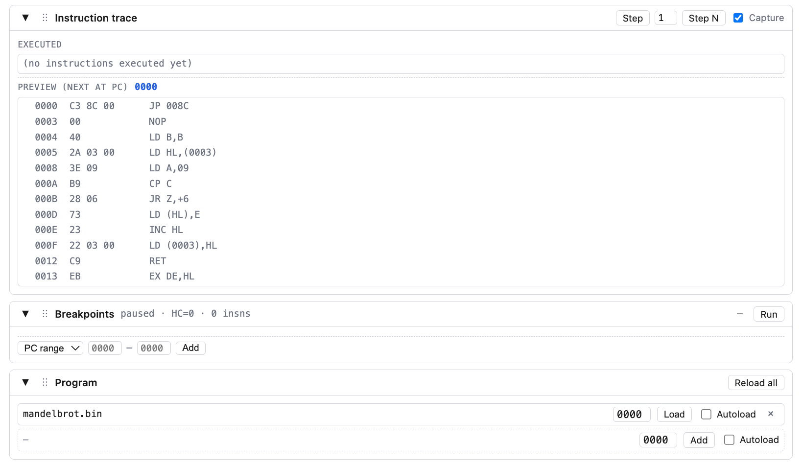
     

2. **Take some steps**
   - In the "Instruction trace" section, make sure "Capture" is enabled.
   - Press "Step".
   - The `JP start` has executed; the instructions at `start` now appear in PREVIEW (NEXT AT PC).
   - 

        
screenshot

     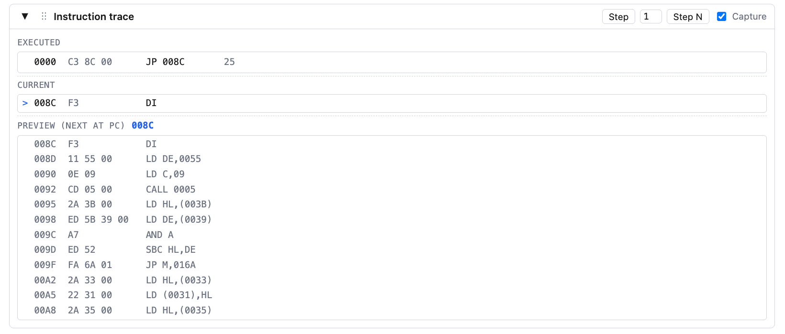
     

   - Open the "Hardware trace" section and make sure "Capture" is enabled.
   - You'll see the bus signals as they were sampled across the just-executed instruction's half-cycles.
   - Press "Step HC" in the "Hardware trace" header several times to advance one half-cycle at a time and watch the signals progress.
   - 

        
screenshot

     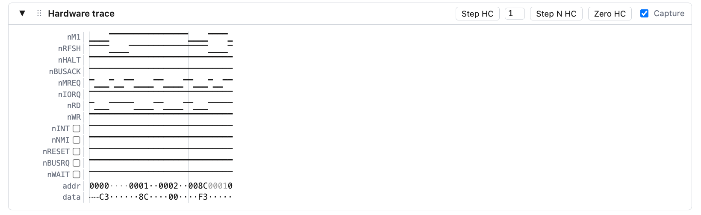
     

3. **Configure the memory view**
   - Go to the "Memory" section.
   - Set the WATCH field to `4100`.
   - Set the WIDTH selector to `128`. Scroll the Memory section horizontally to see only the ASCII pane on the right.
   - Why: the print routine lays out 128-char rows, so Width=128 makes one memory row equal one image row. The Memory pane shows two context rows above the watch address, so Watch=`4100h` parks the buffer origin (`4000h`) at the top of the viewport — the whole picture fits below it.
   - 

        
screenshot

     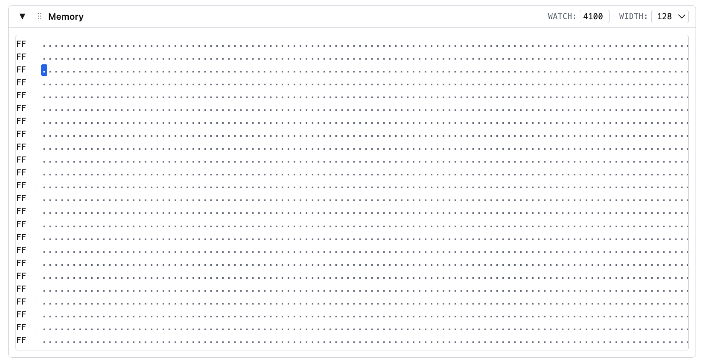
     

4. **Set breakpoints**
   - Go to the "Breakpoints" panel.
   - Note the status line with the half-cycle and instruction counters.
   - Choose kind = **HC count**, target = `30000000`, then "Add".
   - The breakpoint appears in the list; Run will now auto-pause when HC reaches 30,000,000.
   - Add another breakpoint. This time choose kind = **PC range**, set `0173`, then "Add".
   - The breakpoint appears in the list; Run will now auto-pause when PC enters the range starting at `0173h`, right after the HALT instruction at the end of the program.
   - 

        
screenshot

     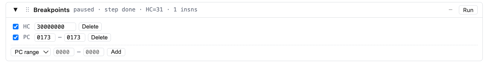
     

5. **Run the program**
   - Press "Run". Execution pauses at HC = 30,000,000 (reason: `HC target 30000000`).
   - Notice the **Effective emulated clock** indicator next to "Run" — host T-state throughput expressed as a Z80 clock.
   - In the "Memory" pane, you can see a partially drawn Mandelbrot.
   - 

        
screenshot

     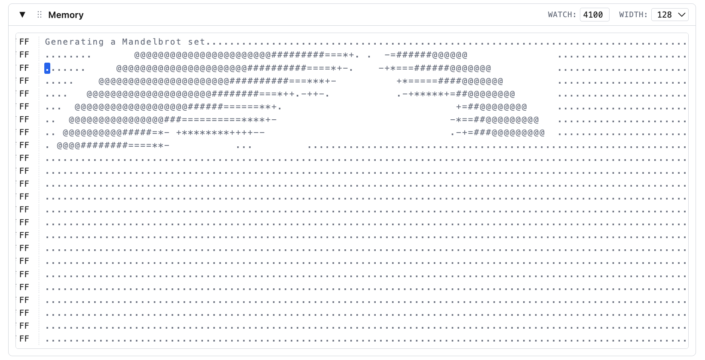
     

   - Press "Run" again. Let it continue until the PC hits the breakpoint range.
   - The computation is complete.
   - 

        
screenshot

     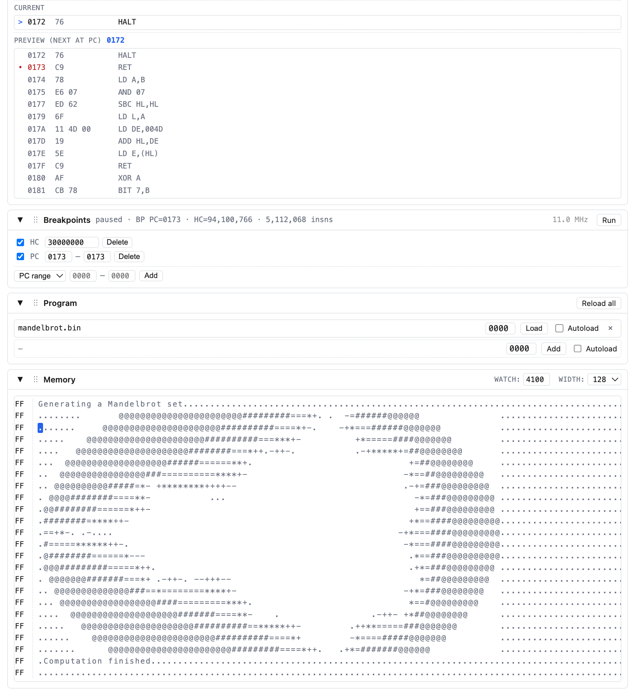
     

6. **Final state**
   - In "Instruction trace" the CPU is halted: each subsequent M1 fetches the byte after `HALT` and discards it — you'll see repeated reads at `HALT+1` in the trace.
   - 

        
screenshot

     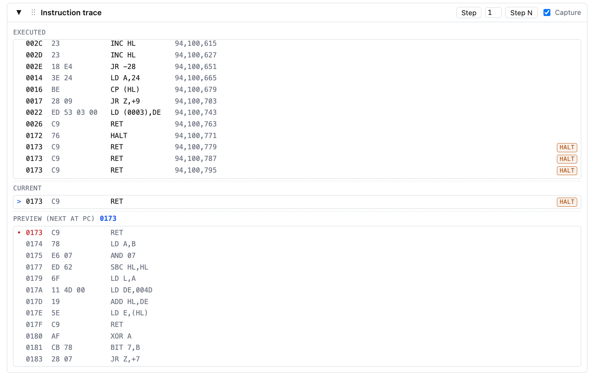
     

   - In "Hardware trace" the `nHALT` signal sits LOW.
   - 

        
screenshot

     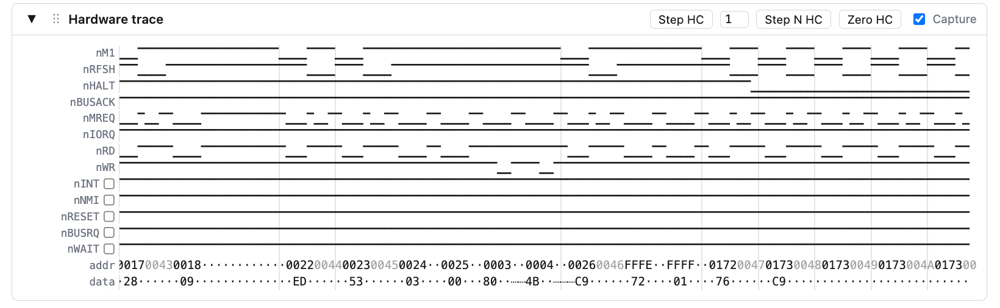
     

7. **Extra: service an NMI**
   - In the "Hardware trace" panel, tick the `nNMI` checkbox to assert the line on the next clock edge (a 1-HC pulse — auto-clears).
   - Press "Step HC" a few times. Before the next M1 cycle (vertical divider), `nHALT` goes HIGH and the NMI acknowledge cycle begins.
   - Two `nWR` LOW pulses appear in that cycle — the CPU pushing the return address onto the stack (PC high byte, then PC low byte).
   - 

        
screenshot

     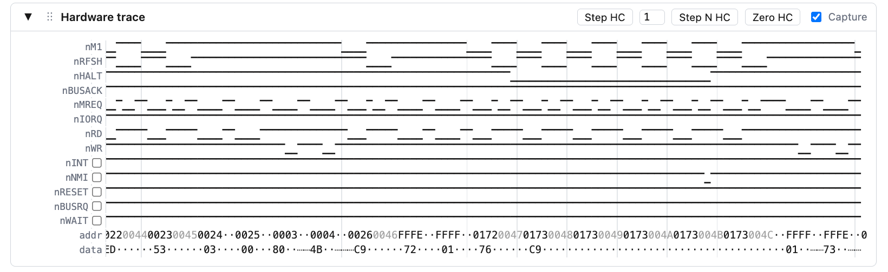
     

   - Press "Step HC" a few more times. The new M1 cycle starts at address `0066` — the NMI service vector.
   - 

        
screenshot

     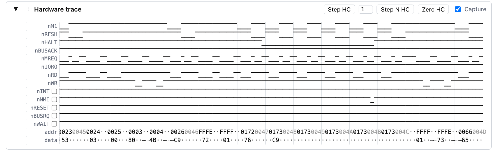
     

   - Open the "Instruction trace" panel.
   - The last instruction row carries an **NMI** marker.
   - Press "Step" — the executed instruction's address is `0066`.
   - 

        
screenshot

     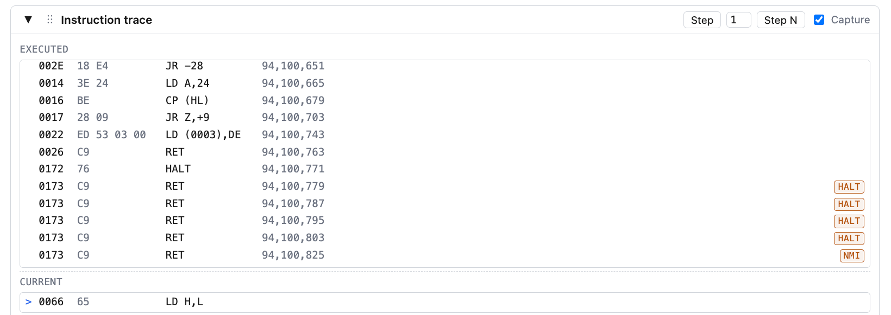
     

That's the tour.
