# Rule 30 — INT-paced cellular automaton

**▶ Follow along on the live app: [dcorp80.github.io/z80cpu-lab](https://dcorp80.github.io/z80cpu-lab/)**

## Description

The classic Wolfram **Rule 30** 1-D cellular automaton, organized as **two cooperative tasks on a single Z80** scheduled by the explorer's **INT generator**:

- **ISR (consumer, IM 1)** — every interrupt emits one cell of the currently-displayed row into the memory-mapped screen at `4000h+`. At end-of-row it sets `ROW_DONE = 1` to signal main. Crucially, **while `ROW_DONE = 1` the ISR returns early** (no emit, no cursor advance) — the row boundary stays frozen until main has swapped the buffer pointers.
- **Main (producer)** — computes the next generation into the *non-displayed* buffer, `HALT`s until `ROW_DONE = 1`, then swaps `DISPLAY_PTR <-> COMPUTE_PTR` (direct cross-store, no `EX DE, HL`) and clears `ROW_DONE` to let the ISR resume.

The ROW_DONE-gated throttle makes the swap race-free without any `DI`/`EI` tricks: while `ROW_DONE = 1` the ISR doesn't touch the pointers, so main can update both in any order with zero risk of a half-state read. When `ROW_DONE` is finally cleared, the next ISR reads the freshly-swapped `DISPLAY_PTR` and resumes the new row from cell 0.

The ISR also uses the **shadow register set** (`ex af, af'` and `exx`) for context save instead of four push/pops — same effect, ~80 T-states shorter per interrupt. Safe here because main never touches the shadows.

128-cell row with toroidal wrap, seeded with a single `1` in the middle. On cells render as `^`, off as space. Screen runs `4000h..BFFFh` (256 rows); the cursor wraps back to `4000h`.

- Source: [rule30.asm](rule30.asm)
- Binary: [rule30.bin](rule30.bin) — download this; you'll load it in step 1.

## Step-by-step

0. **Start cold**
   - Reload the page or press the "Cold Start" button to clear any prior session.

1. **Load the program**
   - Go to the "Program" panel.
   - Click "Add" → select `rule30.bin`.
   - The program is written to the emulator's memory and persisted in browser storage.
   - The disassembled preview appears in the "Instruction trace" section's PREVIEW (NEXT AT PC) panel.
   - 

        
screenshot

     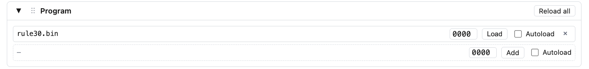
     

2. **Enable the INT generator**
   - Go to the "Interrupts" panel.
   - Turn on the INT generator. Suggested starting values: `period = 13000` HC, `pulseWidth = 64` HC.
   - The period is in **half-cycles** — every Z80 cycle is two HC, so 13000 HC ≈ 6500 T-states between interrupts.
   - 

        
screenshot

     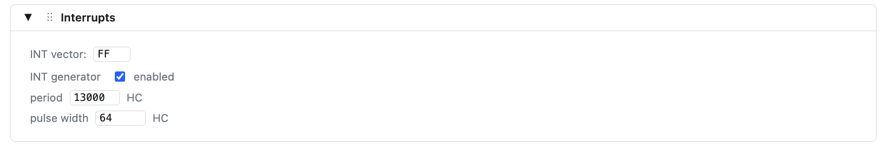
     

3. **Configure the memory view**
   - Go to the "Memory" section.
   - Set the WATCH field to `4000`.
   - Set the WIDTH selector to `128`. Disable the "Hex" view to see only the ASCII pane.
   - Why: each interrupt writes one cell, and `WIDTH = 128` matches the CA width, so one memory row equals one CA generation. The triangle emerges as a single contiguous image.
   - 

        
screenshot

     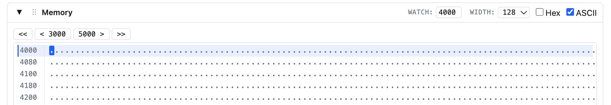
     

4. **Run the program**
   - Press "Run". The Rule 30 triangle grows downward from `4000h`.
   - Let it run for about 20M HC. Press "Pause".
   - Now you have a visible triangle.
   - 

        
screenshot

     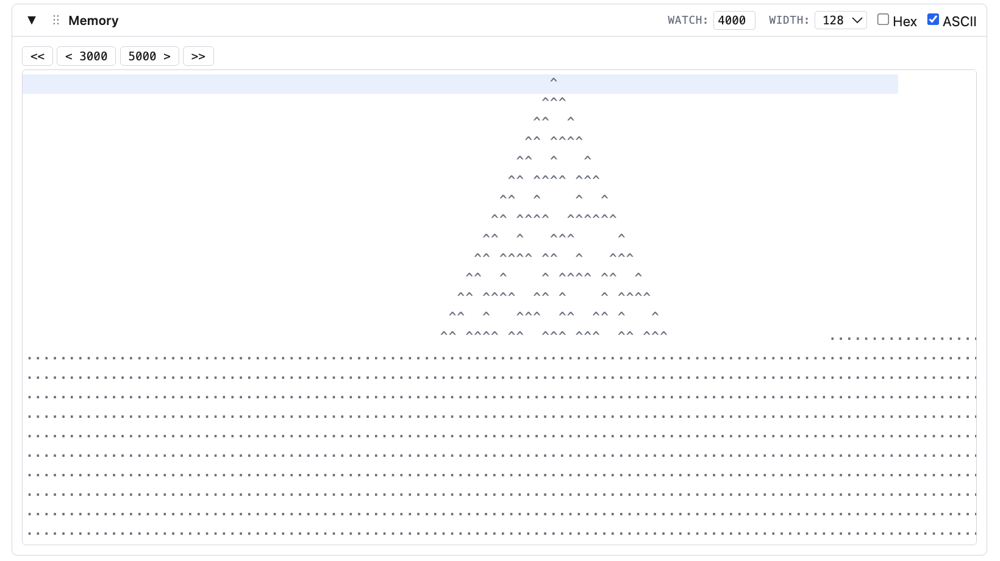
     

5. **Catch an interrupt with a PC breakpoint**
   - Go to the "Breakpoints" panel.
   - Choose kind = **PC range**, set `0038`, then "Add".
   - `0038h` is the IM 1 service vector — the address the CPU jumps to on every maskable interrupt.
   - Press "Run". Execution pauses on the very next interrupt (reason: `BP PC=0038`), with PC parked at the start of the ISR vector.
   - Notice IFF1 and IFF2 are both 0 in the "CPU state" panel — the interrupt has been acknowledged. The "IM 1" marker indicates the interrupt mode.
   - 

        
screenshot

     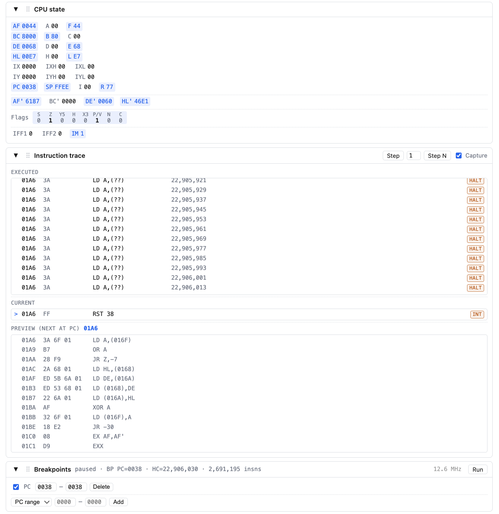
     

6. **Inspect the INT acknowledge cycle**
   - Go to the "Instruction trace" panel.
   - The last instruction row carries an **INT** marker.
   - Press "Step" — the executed instruction's address is `0038`: `JP isr_body`.
   - Press "Step" again — the CPU lands at `isr_body` and runs `ex af, af'`, the first instruction of the shadow-register context save.
   - 

        
screenshot

     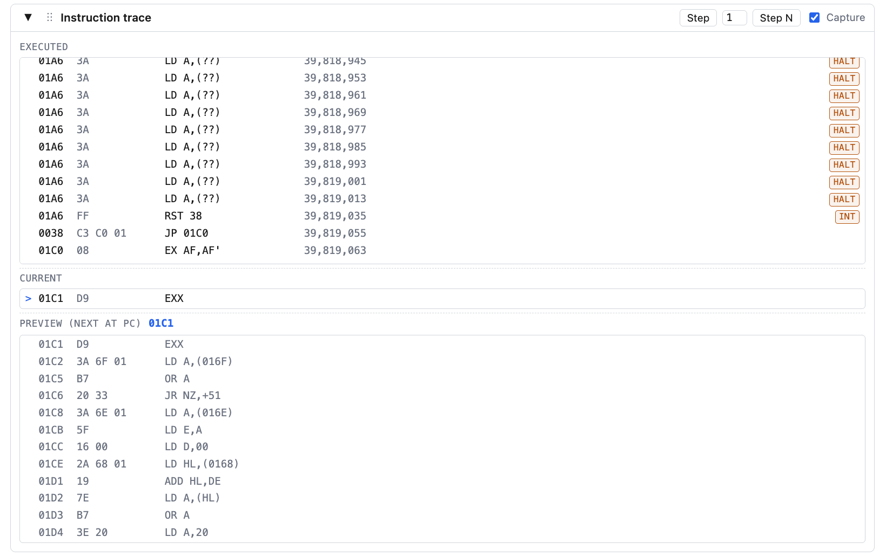
     

   - Press "Step" a few more times to advance into the ISR.
   - Go to the "Hardware trace" section.
   - Before the **INT acknowledge** M1 cycle the `nHALT` signal goes high. `nM1` and `nIORQ` are both LOW at the same time (a normal M1 has `nMREQ` LOW, not `nIORQ`). The byte sampled by the CPU on the data bus is the vector injected by the INT generator. In IM 1 the vector byte is ignored — the CPU always jumps to `0038h` — but the acknowledge cycle still runs on the bus.
     > **Note:**
     The interrupt does not always arrive during `HALT`. If execution pauses at
     `0038h` but the hardware trace does not show a HALT exit, press **Run** again.
     After a few attempts
     the interrupt will usually land while the CPU is halted, making the wake-up
     sequence visible.
   - Two `nWR` LOW pulses follow — the CPU pushing the return address onto the stack (PC high byte, then PC low byte) before jumping to the service vector.
   - The next M1 cycle starts at address `0038`.
   - 

        
screenshot

     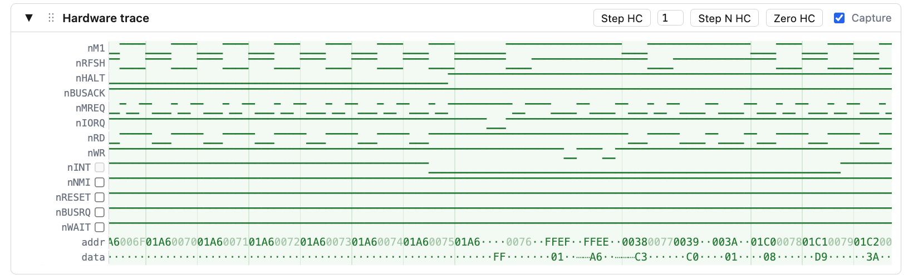
     

7. **Final state**
   - Disable the breakpoint and "Run" the program for about 50M HC more.
   - 

        
screenshot

     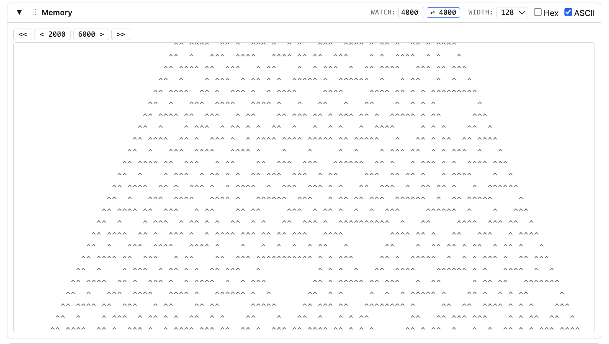
     

   - After ~256 rows the cursor wraps back to `4000h` and starts overdrawing from the top.
   - 

        
screenshot

     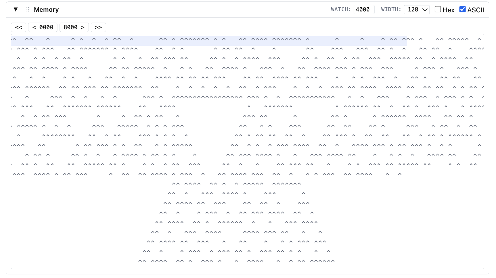
     

   - You can increase the scrollable Memory range by selecting a bigger **Memory page** size in the configuration panel.
   - 

        
screenshot

     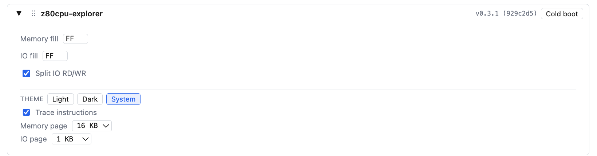
     

8. **Extra: different rule**
   - The instructions `or d` and `xor c` in `rule30_step` are the entire Rule 30. Remove the `or d` and you have **Rule 90** — the Sierpinski triangle.
   - You can do it directly in the **explorer**.
   - For this, start cold and load `rule30.bin`.
   - In the "Memory" panel, go to address `0000` and find the consecutive bytes `B2 A9`. In this version of the binary they start at address `0216`.
   - Change `B2` to `00`, replacing `or d` with `nop`.
   - 

        
screenshot

     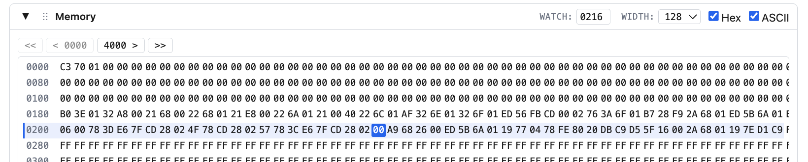
     

   - Run the program for some time. Go back to address `4000` and see the Sierpinski triangle formed in "Memory".
   - 

        
screenshot

     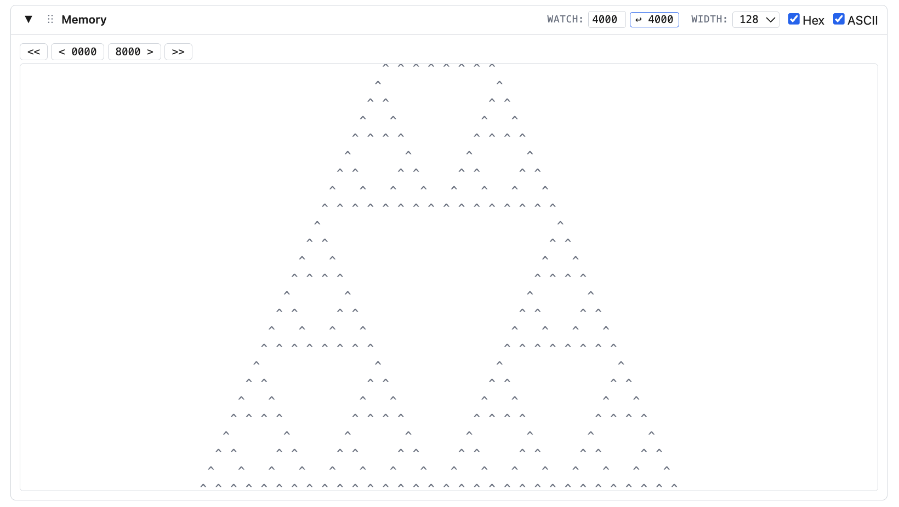
     

That's the tour.
