# RAXOFT z80test

**▶ Follow along on the live app: [dcorp80.github.io/z80cpu-lab](https://dcorp80.github.io/z80cpu-lab/)**

## Description

[z80test](https://github.com/raxoft/z80test) by Patrik Rak (RAXOFT) is a comprehensive Z80 CPU conformance suite originally written for the ZX Spectrum. This example runs it in the emulator against a minimal ZX ROM shim that redirects the suite's print output to memory at `4000h`. A guided tour: load two binaries, configure split-direction IO with a seeded read value, reset the CPU, then let ~2.24B half-cycles of test sweep by — and watch the effective clock climb as you switch off capture and tracing.

- Upstream: https://github.com/raxoft/z80test (MIT, by Patrik Rak — see [THIRD_PARTY_NOTICE.md](THIRD_PARTY_NOTICE.md))
- ROM shim source: [print_zx.asm](print_zx.asm)
- Binaries (download both — loaded in step 2):
  - [print_zx.bin](print_zx.bin) → `0000h`
  - [z80full.bin](z80full.bin)   → `8000h`

## Step-by-step

1. **Start cold** *(optional, but recommended)*
   - Reload the page or press the "Cold Start" button to clear any prior session.

2. **Load both program files**
   - Go to the "Program" panel.
   - Click "Add" and select `print_zx.bin` (loads at `0000h`).
   - Type `8000` into the address field, click "Add" again, and select `z80full.bin`.
   - Both files are written to emulator memory and persisted in browser storage.
   - The disassembled preview appears in the "Instruction trace" section's PREVIEW (NEXT AT PC) panel.
   - 

        
screenshot

     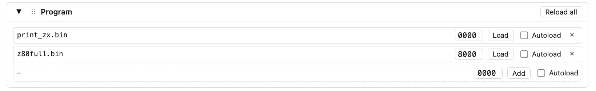
     

3. **Configure the memory view**
   - Go to the "Memory" section.
   - Set the WATCH field to `4000`.
   - Set the WIDTH selector to `32`.
   - 

        
screenshot

     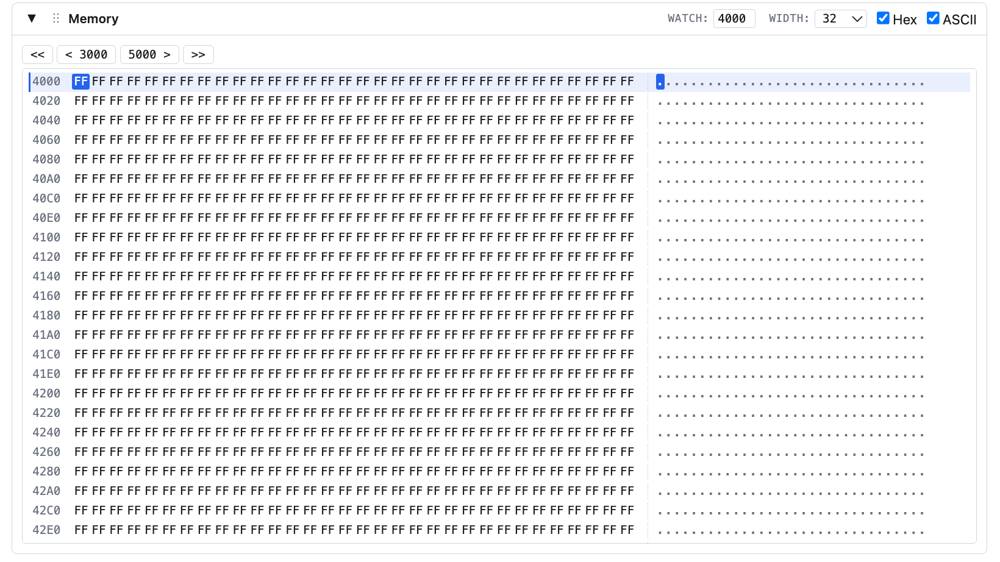
     

4. **Configure IO**
   - Confirm **Split IO RD/WR** is enabled in the topmost configuration section — it's on by default. If it's already on, skip this toggle. This lets the CPU read and write into separate IO spaces.
     > **Note:** Toggling Split IO is destructive — it cold-restarts the emulator, so you'd need to reload the files from step 2.
   - 

        
screenshot

     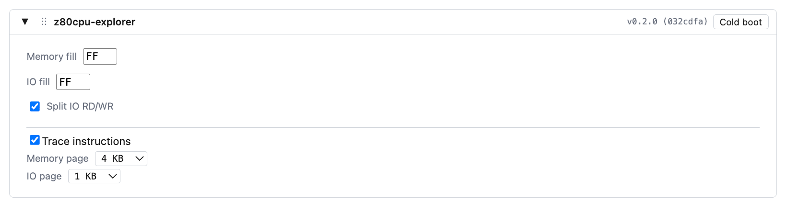
     

   - The test writes various values to port `FEh` but expects to read back only `BFh`. Let's configure that.
   - Select **Decode 8-bit** mode — the test reads from the 8-bit port `FEh`, not the full 16-bit address.
   - Set RD WATCH to `FE`. Click the highlighted cell in the RD (CPU IN, user-editable) panel, enter `BF`, and press Enter.
   - The value `BFh` is now seeded into all 256 ports whose low byte equals `FEh`.
   - You can also set WR WATCH to `FE` to see what the test writes there.
   - 

        
screenshot

     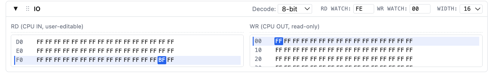
     

5. **Reset** *(skip if you cold-started)*
   - Go to the "Hardware trace" section.
   - Tick the `nRESET` checkbox to assert the RESET line, click "Step HC" three times, then untick `nRESET`.
   - This holds RESET low long enough to be accepted as a normal reset (not a Special Reset).
   - Subsequent Run / Step will start the CPU from address `0`.
   - 

        
screenshot

     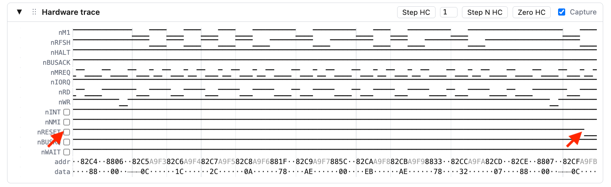
     

6. **Run the test**
   - Press "Run", let it execute for around 200M HC, then press "Pause".
   - In the "Memory" pane, you can see results from the tests that have completed so far.
   - 

        
screenshot

     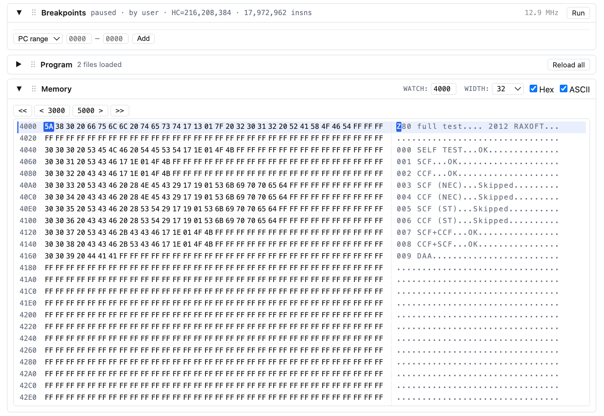
     

7. **Max speed**
   - In the "Hardware trace" panel, uncheck the "Capture" checkbox.
   - Press "Run". Notice the difference in the **Effective emulated clock** indicator readings. Press "Pause".
   - 

        
screenshot

     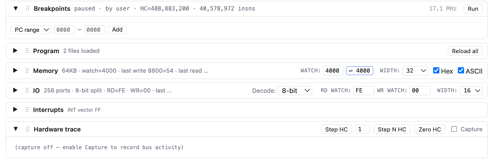
     

   - Go to "Instruction trace" and uncheck "Capture" there as well.
   - Press "Run" and watch the **Effective emulated clock** indicator again. Press "Pause".
   - Even with capture off the emulator is still decoding the current instruction for the PREVIEW panel — that can be disabled too.
   - 

        
screenshot

     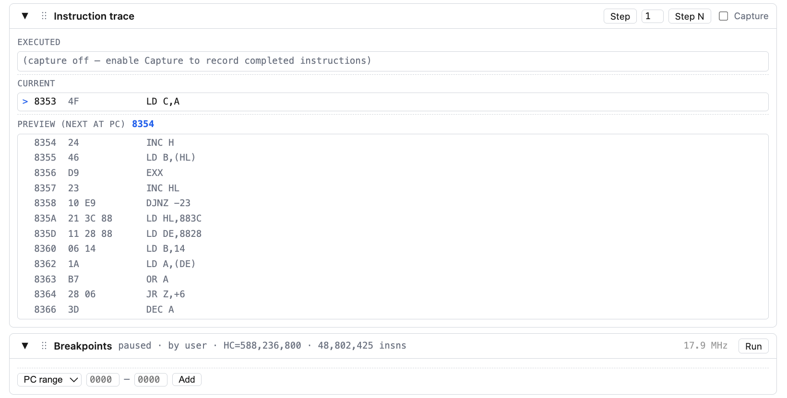
     

   - Go to the header configuration panel and uncheck the **Trace instructions** checkbox. Press "Run".
   - Watch the maximum achievable speed.
   - 

        
screenshot

     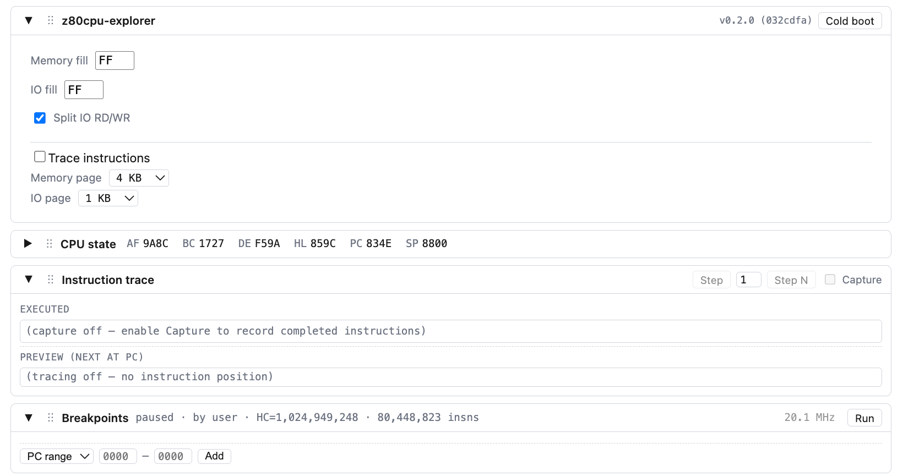
     

8. **Final state**
   - The whole suite runs in about 2.25B HC.
   - You can pause periodically to watch the test results scroll past in the Memory pane.
   - Look at the `IN` tests starting at `4C20h` — they would fail if you skipped the IO configuration step.
   - 

       
screenshot

     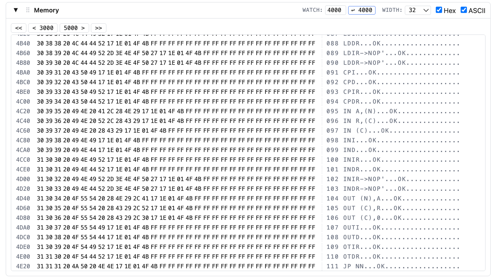
     

   - Click the "5000 >" button to jump to the next page and see the remaining tests and the summary.
     > **Note:** You can change the scrollable page size in the configuration section.
   - All tests should pass.
   - 

       
screenshot

     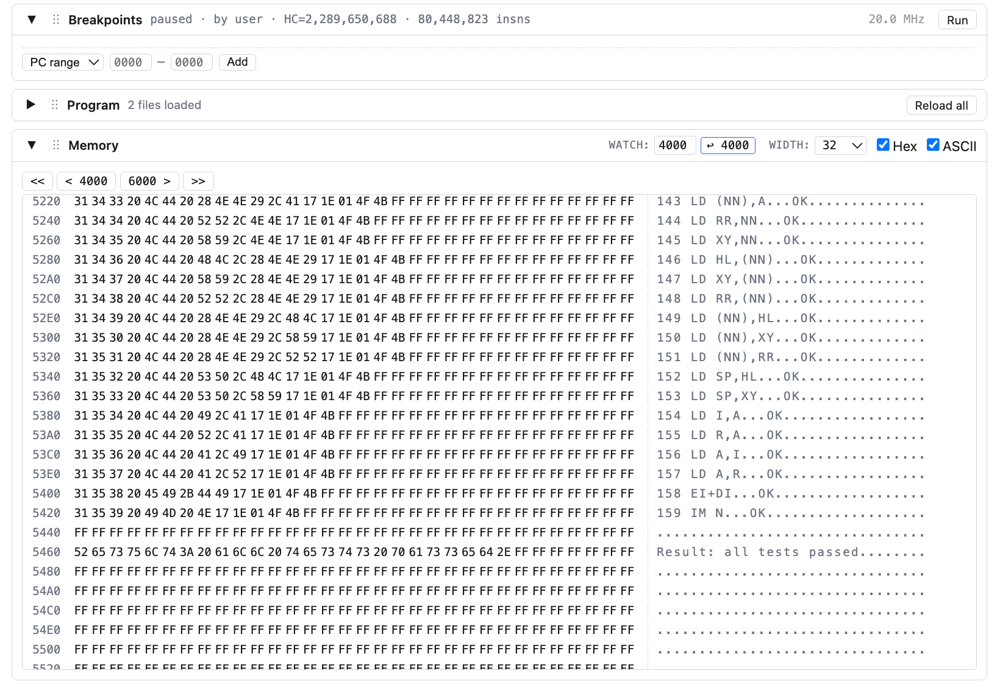
     

That's the tour.
